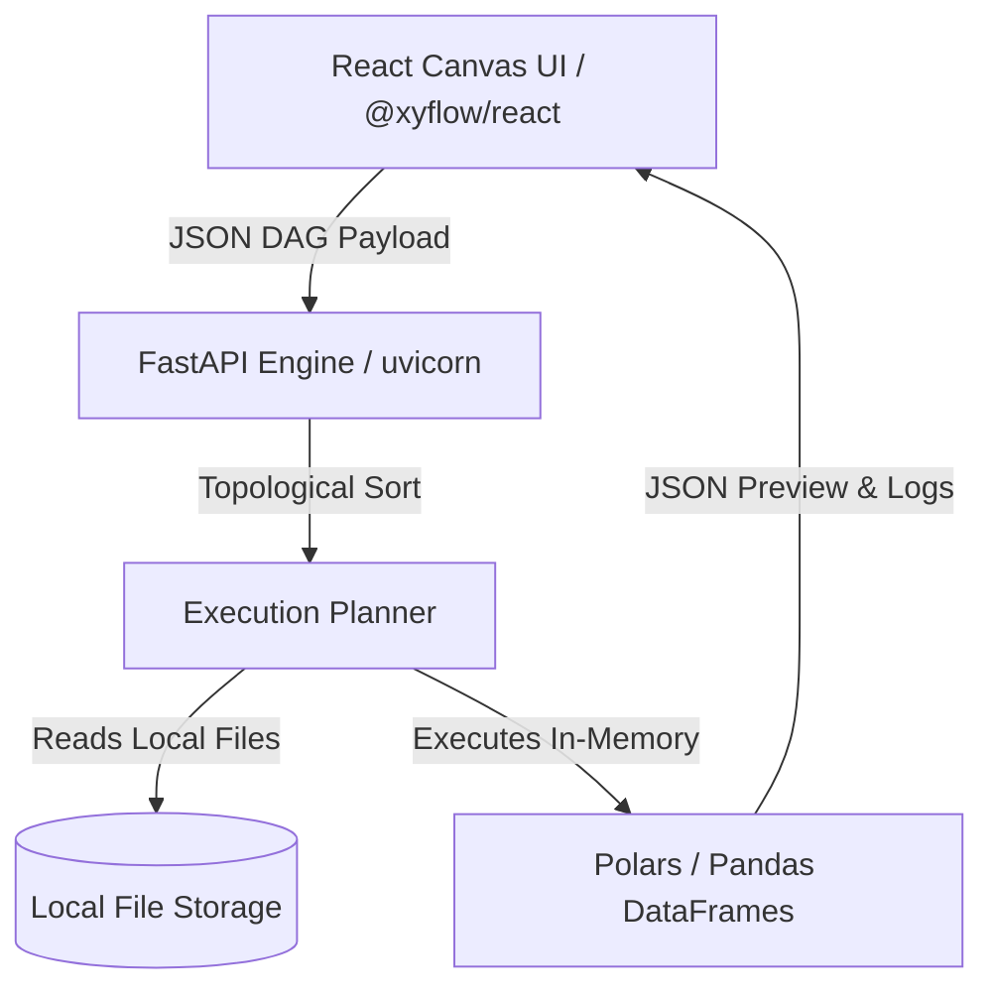
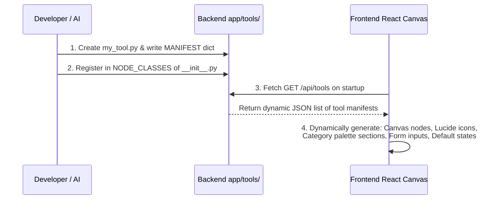

# ⛵ VibeETL

> A self-hosted, lightweight, visual ETL (Extract, Transform, Load) platform inspired by Alteryx.

---

> [!NOTE]
> **🤖 An AI + Human Community Collaboration**
>
> VibeETL is a modern, visual data engineering platform co-created in partnership between **Advanced AI Coding Agents** and the **Human Developer Community**! Built completely from scratch through prompt engineering, this project represents the future of agentic development. The platform is architected specifically so that **both human developers and AI coding agents can easily read this document, understand the rules, and start building new tools immediately**!

Welcome to the **VibeETL** open-source community! 🌍 We are thrilled to have you here. 
Our mission is to build a vibrant, community-driven platform where developers can easily create, share, and manage a vast ecosystem of custom data processing tools. Let your imagination go wild!

VibeETL brings the drag-and-drop visual pipeline building of enterprise tools to a fast, local, and self-hosted environment. It lets you visually construct data workflows, connect nodes with wires, and execute pipelines in-memory utilizing the lightning-fast Rust-based **Polars** engine.

---

## 🎯 The Goal of VibeETL

The primary goal of VibeETL is to bridge the gap between complex code-based data preparation and heavy enterprise ETL licensing, while being highly extensible by the community.

- **Interactive Canvas**: Drag-and-drop tools to build Directed Acyclic Graphs (DAGs) of your data pipeline.
- **In-Memory Executions**: Process data locally using **Polars** (and **Pandas** for specific fallbacks), yielding sub-millisecond execution times.
- **Self-Hosted & Privacy-First**: Run both the web UI and the execution engine entirely on your local machine. No external cloud dependencies or API keys required.
- **File Interoperability**: Ingest CSVs, Excel files, Images (via OCR), and parse tables directly out of PDF documents.

---

## 🛠️ Tech Stack & Architecture

VibeETL is split into two lightweight, decoupled components:



### Frontend (React + Vite)
- **Visual Canvas**: Built using **`@xyflow/react`** (formerly React Flow) for interactive drag, drop, and connection. Supports fully accessible **Mouse-only Select Box** and **Pan** toggles.
- **Iconography**: Styled with **`lucide-react`** icons.
- **Design Language**: Follows a curated light-mode palette inspired by Alteryx, using CSS variables for clean design.

### Backend (FastAPI + Polars)
- **Web API**: Built on **FastAPI** to receive and execute visual graphs.
- **Topological Sorting**: Uses Python's native `graphlib.TopologicalSorter` to parse dependencies and order execution step-by-step.
- **Data Engine**: Built using **Polars** for performant, multi-threaded DataFrame operations.

---

## 📦 Supported Nodes (Tool Palette)

Nodes are color-coded to align with standard data processing categories:

| Category | Color | Node | Description |
| :--- | :--- | :--- | :--- |
| **In / Out** | Green 🟢 | **File Input** | Loads CSV, Excel, PDF, Parquet, or JSON. Autodetects formatting and extracts schema. |
| **In / Out** | Green 🟢 | **Browse** | Displays target schema and preview rows from any point in the workflow. |
| **Prep** | Blue 🔵 | **Filter** | Filters rows using basic operators or custom expressions (e.g., `[Age] > 30 AND [Dept] == 'Sales'`). |
| **Prep** | Blue 🔵 | **Sort** | Sorts the dataset by a selected column in ascending or descending order. |
| **Transform** | Orange 🟠 | **Select** | Keeps/drops columns and renames fields, propagating schemas downstream. |
| **Transform** | Orange 🟠 | **Summarize** | Groups by columns and applies aggregate functions (Sum, Count, Min, Max, Mean). |
| **Transform** | Orange 🟠 | **Regex Parser** | Extracts substrings from columns using Regular Expressions. |
| **Join** | Slate-Gray 🔘 | **Join** | Joins two datasets together based on common keys. |

### 📖 Reference Examples: How the Built-in Nodes Work

To guide your development, here is a detailed breakdown of how each standard node maps parameters to inputs and outputs:

#### 1. File Input Node (`fileInput`)
*   **Purpose**: Read and ingest raw tabular data files.
*   **Category**: In / Out (`inout`)
*   **Parameters**:
    *   `filePath` (String): The path or filename of the target file.
    *   `fileType` (String): `"auto"`, `"csv"`, `"excel"`, `"pdf"`, `"parquet"`, or `"json"`.
    *   `detectedSchema` (Array of objects): Caches the column list.
*   **Schema Output**: Dynamically read from the file structure (e.g. `[{"name": "ColA", "type": "String"}, ...]`).

#### 2. Image Ingest / Captioning Node (`imageCaption`)
*   **Purpose**: Feed local visual media files to a lightweight ONNX model on the CPU to generate semantic annotations.
*   **Category**: In / Out (`inout`)
*   **Parameters**:
    *   `imagePath` (String): Local absolute path or uploaded photo filename.
*   **Schema Output**:
    *   Always outputs a fixed schema containing image characteristics:
        *   `ImagePath` (String)
        *   `ResolvedPath` (String)
        *   `Description` (String) - *containing the model's generated caption*
        *   `Dimensions` (String)
        *   `Format` (String)

#### 3. Filter Node (`filter`)
*   **Purpose**: Filter the rows of the dataset using a conditional predicate.
*   **Category**: Prep (`prep`)
*   **Parameters**:
    *   `filterType` (String): Filter Mode (`"basic"` or `"custom"`).
    *   `column` (String): Upstream column name to inspect (Basic Mode).
    *   `operator` (String): Basic operator (`"=="`, `"!="`, `">"`, `"<"`, `">="`, `"<="`, `"contains"`, `"not_contains"`, `"starts_with"`, `"ends_with"`, `"is_null"`, `"is_not_null"`, `"in"`, `"not_in"`, `"matches_regex"`).
    *   `value` (String): Operand comparison string/number (Basic Mode).
    *   `customExpression` (String): Custom boolean expression (e.g., `[Age] > 30 AND [Dept] == 'Sales'`).
*   **Schema Output**: Passes the exact incoming upstream schema through unchanged.
*   **Note**: Implements **two output handles** (`T` for True matching rows and `F` for False matching rows) allowing for conditional data stream branching.

#### 4. Sort Node (`sort`)
*   **Purpose**: Sort dataset rows using a selected column.
*   **Category**: Prep (`prep`)
*   **Parameters**:
    *   `column` (String): Upstream column name to sort by.
    *   `descending` (Boolean): Sort order direction.
*   **Schema Output**: Passes the incoming upstream schema through unchanged.

#### 5. Select / Rename Node (`select`)
*   **Purpose**: Modify the fields of the schema before passing it subsequent nodes.
*   **Category**: Transform (`transform`)
*   **Parameters**:
    *   `columns` (Array of configs): List of column modifications:
        *   `name` (String): Original column name.
        *   `keep` (Boolean): Toggle column retention.
        *   `rename` (String): New column name (optional).
*   **Schema Output**: Alters the schema by dropping unkept columns and renaming kept columns, passing the updated structure downstream.

#### 6. Browse Node (`browse`)
*   **Purpose**: Terminal inspect window displaying schema profiles and dataframe records.
*   **Category**: In / Out (`inout`)
*   **Parameters**: *None*
*   **Schema Output**: Passes the incoming upstream schema through unchanged.

#### 7. Join Node (`join`)
*   **Purpose**: Combines two input datasets based on specified key columns for each dataset.
*   **Category**: Join (`join`)
*   **Parameters**:
    *   `left_keys` (Array of Strings): Left Key Column(s)
    *   `right_keys` (Array of Strings): Right Key Column(s)
    *   `how` (String): Join Type (`"inner"`, `"left"`, `"outer"`, `"semi"`, `"anti"`)
*   **Schema Output**: Combines columns from both input schemas based on the join logic.

#### 8. Summarize Node (`summarize`)
*   **Purpose**: Performs grouping and aggregation operations on datasets.
*   **Category**: Transform (`transform`)
*   **Parameters**:
    *   `group_by` (Array of Strings): Group By Column(s) selected via multi_column_select
    *   `agg_column` (String): Aggregation Column
    *   `agg_function` (String): Aggregation Function (`"sum"`, `"count"`, `"min"`, `"max"`, `"mean"`)
    *   `output_name` (String): Output Column Name
*   **Schema Output**: Outputs a new schema containing the grouped columns and the new aggregated column.

#### 9. Regex Parser Node (`regex`)
*   **Purpose**: Extracts substrings into new columns using Regular Expression capture groups.
*   **Category**: Transform (`transform`)
*   **Parameters**:
    *   `column` (String): Target Column to apply the regex pattern.
    *   `pattern` (String): Regex Pattern with capture groups `(...)`.
    *   `outputColumns` (Array of objects): Dynamic list of capture group names and types (e.g. `[{"name": "Col1", "type": "String"}]`).
*   **Schema Output**: Appends the extracted capture group columns to the incoming schema.

---

## 📋 Prerequisites & System Requirements

VibeETL is designed to be **extremely inviting and easy to set up**! All code runs 100% locally on your machine. To get started, you only need a couple of basic developer tools installed:

1. **Python 3.10+**: The backend data solver runs on Python.
2. **Node.js 18+**: The visual React canvas relies on Node.
3. **Tesseract OCR (Optional)**: 🌟 *Only needed if you plan to parse text directly out of image files!* If you use the Image OCR feature, Tesseract-OCR is required:
   * **Windows**: Download the 1-click setup from [UB Mannheim's Tesseract Installer](https://github.com/UB-Mannheim/tesseract/wiki).
   * **macOS**: Install in 3 seconds via Homebrew: `brew install tesseract`.
   * **Linux**: Run: `sudo apt install tesseract-ocr`.

Everything else—including python virtual environments, canvas interfaces, libraries, and Polars engines—is **fully handled and installed automatically** by our automated startup scripts! No manual config headache required.

---

## 🚀 How to Run (Quick Start)

To make VibeETL user-friendly for tech-savvy users, we have provided automated startup scripts for both Windows and macOS/Linux.

### Method 1: The Automated Runner (Recommended)

The runner automatically sets up Python virtual environments, installs all dependencies (`pip` and `npm`), and launches both the frontend and backend servers concurrently.

#### Windows (PowerShell)
1. Open PowerShell in the project directory.
2. Run:
   ```powershell
   .\run.ps1
   ```

#### macOS / Linux (Bash)
1. Open your terminal in the project directory.
2. Make the script executable and run:
   ```bash
   chmod +x run.sh
   ./run.sh
   ```

---

### Method 2: Manual Step-by-Step Setup

If you prefer to run the components manually, open two terminal windows:

#### Terminal 1: Backend Setup
```bash
# Navigate to backend
cd backend

# Create & activate Python virtual environment
python -m venv venv
# On Windows:
.\venv\Scripts\activate
# On macOS/Linux:
source venv/bin/activate

# Install requirements
pip install -r requirements.txt

# Start the FastAPI engine
python run.py
```
*The backend API will run on `http://127.0.0.1:8000`.*

#### Terminal 2: Frontend Setup
```bash
# Navigate to frontend
cd frontend

# Install package dependencies
npm install

# Start the Vite development server
npm run dev
```
*The React UI will run (typically) on `http://localhost:5173`.*

---

## 📂 Project Structure

```text
VibeETL/
├── backend/                  # FastAPI Backend Engine
│   ├── app/
│   │   ├── tools/            # Tool executors and .txt parameter descriptions
│   │   ├── cache.py          # Temporary in-memory cache for execution results
│   │   ├── engine.py         # Topological solver and DAG manager
│   │   └── main.py           # FastAPI server endpoints
│   ├── uploads/              # Local store for uploaded CSV/Excel/PDF files
│   ├── requirements.txt      # Python dependencies
│   └── run.py                # Backend entry point
├── frontend/                 # React Canvas UI
│   ├── src/
│   │   ├── components/       # UI Windows (Canvas, ToolPalette, ConfigWindow, etc.)
│   │   ├── App.jsx           # Main controller and State coordinator
│   │   └── index.css         # Styling and Theme Configuration
│   ├── package.json          # Node dependencies
│   └── vite.config.js        # Vite config
├── visual-theme.md           # Theme and styling consistency guidelines
├── run.ps1                   # Windows startup script
└── run.sh                    # Linux/macOS startup script
```

---

## 💡 Quick Demo Flow
1. Start the platform using `.\run.ps1`.
2. Open the UI in your browser.
3. The workspace comes pre-loaded with a working pipeline:
   - **File Input** reading `employees.csv`.
   - Connected to a **Filter** matching `Age > 30`.
4. Click **Run Pipeline** in the top-right corner or turn on **Auto-Run** to see interactive live updates.
5. Watch the node status indicators change in real-time.
6. Click on the **Filter** or **File Input** node to inspect the filtered records and execution log at the bottom.

---

## 🧩 Developer Guide: Adding a Custom Node (For the Community!)

To extend **VibeETL** with your own customized nodes, we have designed a **completely dynamic, zero-frontend-code SDK architecture**! 

Developers do **NOT** need to write any React/Javascript or touch the frontend codebase. Simply build and register a single Python class on the backend, and the platform will automatically render its category group, tool item, icon, custom configuration forms, and canvas node dynamically!

---

### 🚀 Zero-Code UI Integration: How It Works



---

### 1. Step-by-Step Backend Integration (FastAPI + Polars)

#### Step A: Create the Executor Module
Create a new file in [backend/app/tools/](backend/app/tools/) (e.g., `my_custom.py`) that inherits from `BaseNode`.
1. Implement the `execute(self, inputs: Dict[str, pl.DataFrame]) -> pl.DataFrame` method.
2. Define a static `MANIFEST` dictionary outlining the metadata and input parameters.
3. For every `.py` tool you create, create a matching `.txt` file (e.g. `my_custom.txt`) explaining what the tool does, its parameters, and its schema requirements.

#### Step B: Register the Class
Add your new executor class to [backend/app/tools/__init__.py](backend/app/tools/__init__.py) under `NODE_CLASSES`:
```python
NODE_CLASSES = {
    # ... existing nodes ...
    "myCustom": MyCustomNode  # Unique ID mapping to class
}
```

---

### 🎨 The Tool Manifest Specification (`MANIFEST`)

The `MANIFEST` dict tells the frontend exactly how to render the tool in the palette and inside the sidebar.

```python
class MyCustomNode(BaseNode):
    MANIFEST = {
        "id": "myCustom",                # Matches the NODE_CLASSES registration key
        "name": "Math Multiply",          # Premium tool display name in the palette & forms
        "category": "advanced_math",      # Category key. Standard categories: 'inout', 'prep', 'transform'
        "icon": "Gauge",                  # Icon name matching any official Lucide React icon
        "description": "Multiplies a selected column by a numeric multiplier.",
        "ui_schema": [
            {
                "field": "targetColumn",
                "type": "column_select",   # Automatically populates with upstream columns!
                "label": "Column to Scale",
                "default": ""
            },
            {
                "field": "factor",
                "type": "string",          # Standard text input field
                "label": "Multiplier Factor",
                "default": "1.5"
            },
            {
                "field": "roundOutput",
                "type": "boolean",         # Checkbox input element
                "label": "Round to nearest integer",
                "default": False
            }
        ]
    }
```

#### Supported UI Schema Field Types:
*   `string`: Standard text input.
*   `boolean`: Renders as an interactive checkbox.
*   `select`: Dropdown menu. Must specify an `"options": ["A", "B"]` array.
*   `column_select`: Smart dropdown that **automatically populates** with the exact schema columns flowing from upstream nodes!

---

### ⚡ Automatic UI Handling of Icons & Categories

The UI uses elegant reflective systems to dynamically render community-created items:

#### 1. Dynamic Iconography System (`lucide-react`)
*   **How Icons are Maintained**: The frontend parses the `"icon"` string in the tool's `MANIFEST` (e.g., `"Save"`, `"Filter"`, `"ArrowUpDown"`, `"Binary"`) and resolves it dynamically at runtime using the Lucide React exports:
    ```javascript
    import * as Icons from 'lucide-react';
    const IconComponent = Icons[tool.icon] || Icons.Square;
    ```
*   **Aesthetic Coherency**: The **same icon** defined in the backend manifest is displayed in both the **Tool Palette (top bar)** and on the **Canvas Node** itself, ensuring unified visual flow.
*   **Safe Fallback**: If an AI or developer inputs an invalid or misspelled icon name, the UI automatically falls back to a clean, neutral `Square` icon without crashing.

#### 2. Dynamic Categories & Section Headers
*   **Standard Categories**: The standard categories (`inout` - Green, `prep` - Blue, `transform` - Orange) render with their matching professional custom borders, glow shadows, and tints.
*   **Custom Categories**: If you specify a new category key (e.g., `"advanced_math"`), the Tool Palette automatically:
    1. Detects it and creates a **brand-new section group** on the left.
    2. Formats the section header dynamically into beautiful title case (e.g., `"advanced_math"` becomes **"Advanced Math"**).
    3. Styles the new category items with a premium **Slate-Gray background/border fallback theme** (`background: rgba(100,116,139,0.05)`), maintaining the design aesthetics perfectly.
    4. Flows new category groups naturally from left to right as developers add them.

---

### 🧪 Standard Testing & Quality Check

To guarantee your new tool is robust and compatible before shipping:
1. Run the compatibility testing suite:
   ```bash
   python -m unittest backend/test_tool.py
   ```
2. Ensure your tool inherits from `BaseNode` and properly validates incoming DataFrames. If an expected column is missing from upstream, raise `SchemaCompatibilityError` to provide clear debugging logs to the canvas.

---

### 🤖 AI Agent Developer Guide (Prompt-to-Tool Specs)

If you are an **AI Coding Agent (Gemini, Claude, GPT, etc.)** reading this codebase to add a new tool or fix an issue, follow these exact technical specifications to ensure absolute coherency with the visual pipeline platform:

#### 1. Zero UI Code Rule
Do **not** modify any Javascript or React files (`frontend/src/...`) to register new tools or build custom configuration inputs. The entire frontend is dynamically driven by the backend. Simply write your Python module in `backend/app/tools/` and define the `MANIFEST` dictionary exactly matching our specifications. The UI will automatically compile and render it.

#### 2. MANIFEST Contract Rules for AI:
*   Ensure `"id"` is a camelCase string (e.g. `mathMultiply`) and matches the registration key inside `backend/app/tools/__init__.py`.
*   Choose `"icon"` from standard [Lucide-React Icons](https://lucide.dev/icons) (e.g. `Calculator`, `Gauge`, `Zap`, `Workflow`, `Brain`). Always double-check spelling.
*   Make sure `"category"` is a lowercase string. If it is a new domain, the UI will automatically group it and generate Title Case headers dynamically.
*   Specify `"ui_schema"` inputs carefully:
    *   For column operations, always use `"type": "column_select"` so the UI automatically loads upstream schemas.
    *   Set sensible `"default"` values so the engine does not fail on empty configurations.

#### 3. In-Memory execution contract:
*   Your executor class must inherit from `BaseNode`.
*   Always implement `execute(self, inputs: Dict[str, pl.DataFrame]) -> pl.DataFrame`.
*   Use standard **Polars** (`import polars as pl`) for sub-millisecond, multi-threaded DataFrame operations. Avoid heavy disk writing unless explicitly requested.
*   Log meaningful steps using `self.log("Message text")` so the user can debug the execution live from the canvas log panels.

#### 4. Verification Check:
Before ending your task, run:
```bash
python -m unittest backend/test_tool.py
```
This guarantees your manifest is perfectly formatted and compatible with the dynamic form solver!

not fail on empty configurations.

#### 3. In-Memory execution contract:
*   Your executor class must inherit from `BaseNode`.
*   Always implement `execute(self, inputs: Dict[str, pl.DataFrame]) -> pl.DataFrame`.
*   Use standard **Polars** (`import polars as pl`) for sub-millisecond, multi-threaded DataFrame operations. Avoid heavy disk writing unless explicitly requested.
*   Log meaningful steps using `self.log("Message text")` so the user can debug the execution live from the canvas log panels.

#### 4. Verification Check:
Before ending your task, run:
```bash
python -m unittest backend/test_tool.py
```
This guarantees your manifest is perfectly formatted and compatible with the dynamic form solver!

