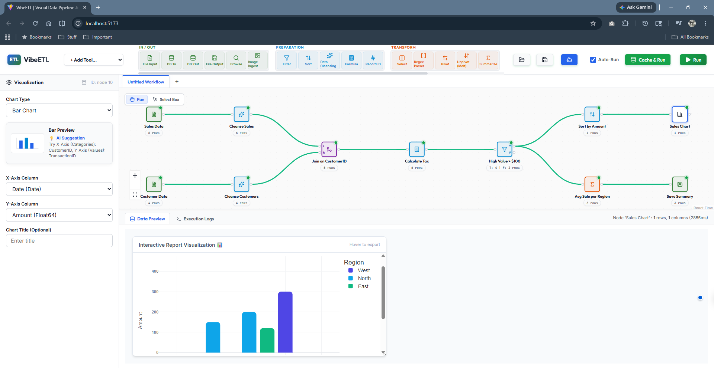
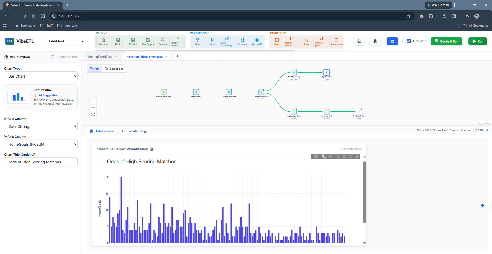
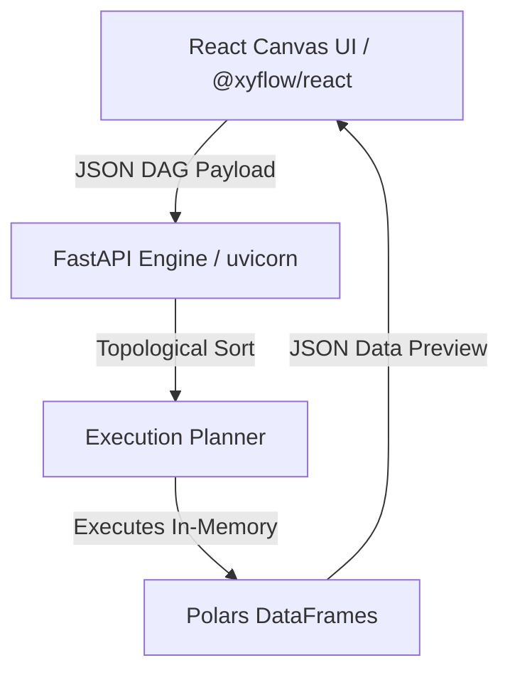

<div align="center">
  
  
  # ⛵ VibeETL
  
  **A self-hosted, lightweight, visual ETL (Extract, Transform, Load) platform inspired by enterprise data engineering tools.**

  [](https://opensource.org/licenses/MIT)
  [](http://makeapullrequest.com)
  [](https://pola.rs/)
  [](https://reactflow.dev/)
</div>

<div align="center">
  
  <br>
  <i>Build lightning-fast Polars data pipelines visually via an interactive React Flow DAG canvas.</i>
</div>

<br>

<div align="center">
  
  <br>
  <i>Configure tools effortlessly using enterprise-grade, compact spreadsheet-like UI panels.</i>
</div>

---

> [!NOTE]
> **🤖 An AI + Human Community Collaboration**
>
> VibeETL is a modern, visual data engineering platform co-created in partnership between **Advanced AI Coding Agents** and the **Human Developer Community**! Built completely from scratch, this project represents the future of agentic development. 

Welcome to the **VibeETL** open-source community! 🌍 Our mission is to build a vibrant, exciting, and beautiful platform where data engineers and analysts can effortlessly create, share, and manage a vast ecosystem of custom data processing tools. Let your imagination go wild! 🚀

VibeETL brings the drag-and-drop visual pipeline building of massive enterprise tools directly to your local machine. Visually construct your data workflows, connect nodes with wires, and execute pipelines in-memory utilizing the lightning-fast Rust-based **Polars** engine. Whether you're dealing with a tiny CSV or millions of rows from a massive SQL warehouse, VibeETL handles it with absolute elegance.

---

## 🎯 Core Philosophy

VibeETL bridges the gap between complex code-based data preparation and heavy enterprise ETL licensing.

- **Interactive Canvas**: Drag-and-drop tools to build Directed Acyclic Graphs (DAGs) of your data pipeline.
- **In-Memory Executions**: Process data locally using **Polars** yielding sub-millisecond execution times.
- 🐘 **Big Data Ready**: Connect directly to massive SQL Databases (PostgreSQL, MySQL, SQLite, etc.) via highly-parallelized `connectorx` Arrow drivers.
- 🧠 **Smart DAG Pruning**: Fully integrated node-caching capabilities. Lock a node's state to prevent upstream re-execution, saving you tremendous time during workflow development.
- 🏗️ **Union & Deduplication**: Stack datasets seamlessly or isolate distinct entries.
- 📊 **Interactive Web Visuals**: Dynamically generate rich, interactive Scatter, Line, Bar, and Box plots using the integrated `Plotly` HTML backend. Hover, zoom, and pan directly inside your results grid!
- ✨ **Multimodal Generative AI**: Seamlessly process Text, Images, Video, and Audio using the integrated **Gemini AI** node! Throw files and prompts at the node and watch it dynamically extract data into a new column.
- 🐍 **Advanced Python Scripting**: A built-in Python tool featuring a beautifully integrated **native syntax-aware IDE**, complete with column-aware autocompletion (just type `df["`). Contains pre-built templates for hitting external APIs or running custom LLMs directly inside your pipeline!
- 🤖 **Agent-Ready Architecture**: Export your complex mathematical workflows into an ultra-clean, machine-readable YAML file in one click. Send this single file to any AI Agent or LLM to automate, improve, or instantly orchestrate your intelligence platform from scratch!
- 💾 **Workflow Save/Load**: Never lose your progress. Export your complete ETL pipeline architecture to JSON and restore it at any time directly from the visual canvas.
- 🤝 **Share & Collaborate**: Because workflows are saved as ultra-lightweight JSON files, you can instantly share them over Slack, Discord, or GitHub! The community can load your exact pipeline to help you debug errors, build custom visualizations, or extend your data models.
- 🛡️ **Zero Data-Loss Auto-Recover**: VibeETL features an enterprise-grade, two-tier autosave system. Workflows are instantly cached to your browser locally, while a debounced network process physically streams rolling `.autosave` increments to your backend server to protect you against catastrophic cache-wipes!
- 🗂️ **Multi-Tabbed Workspaces**: Work on multiple isolated DAGs simultaneously, just like a modern IDE! Open, swap, and execute multiple independent pipelines via a seamless tab bar without ever overwriting your progress.
- 📂 **Flexible I/O**: Ingest CSVs, Excel files, Images (via AI OCR), parse tables directly out of PDFs, or write out fully interactive HTML visualizations.
- **Self-Hosted & Privacy-First**: Run both the web UI and the execution engine entirely on your local machine. No external APIs required (unless explicitly using the Gemini node).

## 🎨 Enterprise UI & Semantic Intelligence

VibeETL brings the dense, hyper-productive feel of professional enterprise suites into the open-source era:

- 📊 **Alteryx-Inspired Configuration Panels**: We've replaced bulky forms with compact, spreadsheet-like tabular grids. Manage hundreds of columns in a single dense view using intuitive checkboxes, dropdowns, and text fields—all while maintaining a gorgeous glassmorphic aesthetic.
- 📦 **Tool Containers**: Seamlessly group workflows into bounded, resizable visual containers. Disable entire containers with a single click to instantly bypass massive chunks of logic during execution!
- ⚡ **Multi-Rule Sorting & Summarization**: Build incredibly complex group-by chains and sequential sorting rules seamlessly. Our native Polars backend engine rips through multi-column aggregations instantly!
- 🧠 **Semantic Type Profiling**: VibeETL's execution engine automatically profiles incoming data to detect logical semantic types (like `currency_usd`, `percentage`, `email`).
- 💎 **Semantic Propagation**: When a semantic type is detected, the Engine maps it directly through the computational DAG! This metadata drives intelligent UI rendering—displaying `$` badges in your preview grid, formatting Plotly axes dynamically into currency layouts, and guiding users seamlessly.
- ⭐ **Dynamic Tool Favorites**: Fully customize your workspace! Pin any tool to your exclusive "Favorites" group by clicking its Star badge, completely eliminating scrolling and searching when building workflows. Your preferences are instantly saved to your browser's local storage and flawlessly restored across sessions!
- 🔢 **True Sequential Numbering & Find**: Navigating massive workflows is incredibly easy with true, clean sequential Node IDs (`node_1`, `node_2`) that make hitting the "Find" bar extremely powerful and accurate.
- ✨ **Smart Canvas Mechanics**: Magnetic wire snapping, node-collision detection, cascading auto-drops, and a dedicated "Clear All Cache" tool keep the canvas incredibly responsive and visually flawless!

---

## 🛠️ Architecture at a Glance

VibeETL is decoupled into a hyper-fast frontend and a robust backend engine.



---

## 📦 Extensive Built-in Tool Palette

VibeETL comes pre-loaded with an extensive suite of data engineering nodes, elegantly categorized into pipelines.

| Category | Color | Included Tools |
| :--- | :--- | :--- |
| **In / Out** | Green 🟢 | `File Input`, `Database Input`, `Browse`, `File Output`, `Database Output`, `Image Ingest` |
| **Cloud** | Cyan 🩵 | `Google Sheets In`, `Google Sheets Out`, `GCS Input`, `GCS Output` |
| **Preparation** | Blue 🔵 | `Filter`, `Sort`, `Cleanse`, `Formula Compute`, `Unique`, `Regex`, `Record ID`, `Sample Records` |
| **Transform** | Orange 🟠 | `Select`, `Pivot`, `Unpivot`, `Summarize`, `Date Time` |
| **Join** | Purple 🟣 | `Union`, `Join` |
| **Analysis** | Pink 🦩 | `Gemini AI (Multimodal LLM)`, `Visualization`, `Python Code`, `LLM Chunker` |

> 🚀 **More Tools on the Horizon!**
> We are continuously expanding the VibeETL ecosystem! We have recently launched the **Cloud Connectors** suite, meaning `Google Sheets` and `Google Cloud Storage (GCS)` nodes are now partially ready for community use and testing! Expect more advanced integrations like Machine Learning predictors and geospatial transformers very soon.
> 
> 🌍 **We invite you to build with us!** 
> VibeETL is built by and for the community. If you have an idea for a custom data tool, use our Zero-Code SDK to build it and submit a Pull Request! Help us complete the platform and make it the ultimate open-source intelligence powerhouse. Let's build the future together! 🤝

> 📖 **Looking for a deep dive into each tool?**
> Check out our comprehensive [Node Reference Guide](docs/Nodes_Reference.md) for parameter breakdowns, expected schemas, and configuration examples for all built-in ETL tools.

---

## 🚀 Quick Start Guide

To make VibeETL user-friendly for tech-savvy users, we have provided automated startup scripts that instantly handle virtual environments, npm packages, and dual-server startup!

### Method 1: The Automated Runner (Recommended)

**Windows (PowerShell)**
```powershell
.\run.ps1
```

**macOS / Linux (Bash)**
```bash
chmod +x run.sh
./run.sh
```

### Method 2: Manual Step-by-Step

If you prefer to run the components manually in separate terminals:

**Backend (Terminal 1)**
```bash
cd backend
python -m venv venv
.\venv\Scripts\activate  # (Or source venv/bin/activate on Mac/Linux)
pip install -r requirements.txt
python run.py
```

**Frontend (Terminal 2)**
```bash
cd frontend
npm install
npm run dev
```

---

## 🧩 Developer Guide: Zero-Code UI Integration

To extend **VibeETL** with your own customized nodes, we have designed a **completely dynamic SDK architecture**! 

Developers do **NOT** need to write any React/Javascript to build forms! Simply build and register a single Python class in `backend/app/tools/`, define a `MANIFEST` dictionary, and the platform will automatically generate your Canvas nodes, Lucide icons, Category groups, Form inputs, and Default states dynamically at runtime!

*Check the codebase for examples of how our dynamic manifests automatically render complex UI components like multi-select dropdowns, data previews, and code-completion textareas!*

---
<div align="center">
  <i>Built with ❤️ by the VibeETL Community.</i>
</div>
